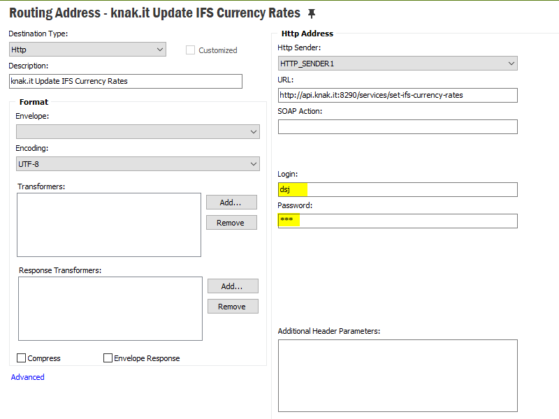
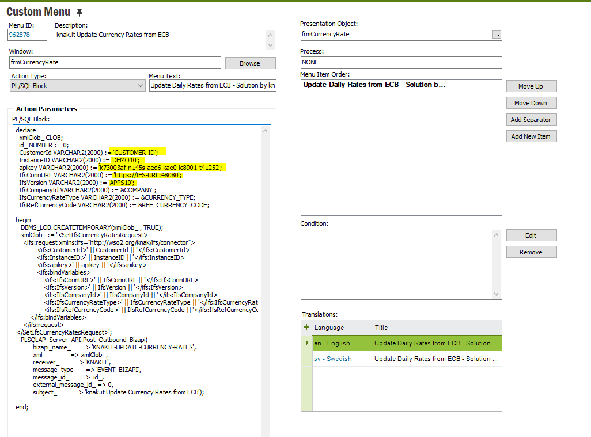

# An out of the box solution for updating IFS currency rates
knak.it IFS Currency Rates API is a free service for updating IFS currency rates values [published by the European Central Bank](https://www.ecb.europa.eu/stats/policy_and_exchange_rates/euro_reference_exchange_rates/html/index.en.html).
It is an out of the box solution to update the IFS currency rates with a single click and without needing to worry about any customization or aditional configuration.

## Jump to
* [Getting Started](#getting-started)
* [Setup](#setup)
* [About the API and Usage](#about-the-api-and-usage)
* [Troubleshoot](#troubleshoot)
* [FAQ](#faq)
* [Issues/Feature requests](#issuesfeature-requests)
* [Credits](#credits)


## Getting Started
You need a API key (which is free) to use the service. Send an email to [knakit.dev@gmail.com](mailto:knakit.dev@gmail.com?subject=IFS%20Currency%20Rates%20API%20key) with following information.
- [x] Customer ID: Your company name
- [x] Instance ID: IFS Instance (Dev/Test/Prod...etc)
- [x] IFS Url: IFS Instance url with port
- [x] IFS Version - Your IFS version (APPS75, APPS8, APPS9, APPS10)
- [x] Customer Contact: email for us to update about API changes or downtimes

## Setup
#### IFS Connect Setup
1. Download following files inculded in [source/ifs](https://github.com/knakit/set-ifs-currency-rates-api/tree/main/source/ifs)
   * [Routing Address](source/ifs/server/connect_config/RouteAddress_knak.it_Update_IFS_Currency_Rates.xml)
   * [Routing Condition](source/ifs/server/connect_config/RouteCondition_knak.it_Update_IFS_Currency_Rates.xml)

2. Import Routing Address
   * Go to the Routing Adresses, Right mouse click, Import Address.
   * Locate [RouteAddress_knak.it_Update_IFS_Currency_Rates.xml](source/ifs/server/connect_config/RouteAddress_knak.it_Update_IFS_Currency_Rates.xml) downloaded in step 1 and Press Open.
   *  Locate ```knak.it Update IFS Currency Rates``` routing address.
   * Right mouse click, Show Details
   * Input IFS UserID and Password to invoke the request

|  | 
|:--:| 
| *Routing Address setup* |


:red_square: Please read [FAQ](#faq) section on how to setup user and permission.

3. Import Routing Rule
   *  Go to the Routing Rules. Switch to Outbound tab. Right mouse click, Import Rule.
   *  Locate [RouteCondition_knak.it_Update_IFS_Currency_Rates.xml](source/ifs/server/connect_config/RouteCondition_knak.it_Update_IFS_Currency_Rates.xml) downloaded in step 1 and Press Open.

#### Setup Custom Menu in IFS EE Currency Rates window
1. Download following files inculded in [source/ifs](https://github.com/knakit/set-ifs-currency-rates-api/tree/main/source)
   * [Application Configuration Package](source/ifs/server/appconfig/knakit-set-ifs-currency-rates-api.zip)

2. Import and Publish Application Configuration Package
   * Go to the Application Package, Right mouse click on the Custom Menu item, Show Details
   * Change the highlighted fields with corresponing values you got with the api key email

|  | 
|:--:| 
| *Custom Menu setup* |

3. Go to the Currency Rates window. Right mouse click on header, Properties. Make sure Include Custom Items is checked.
4. If you don't see the Custom menu, try right click, Custom Objects, Reload Configuration.

## About the API and Usage
This API is designed to update IFS currency rates from European Central Bank(ECB). You can either create a custom menu to update currency rates whenever required or schedule it to run daily as a IFS scheduled task or Windows task. To use this service, your IFS instance must be open to internet. If your IFS is not open to internet and you are still interested in using this service, please get in touch with [knakit.dev@gmail.com](mailto:knakit.dev@gmail.com).

#### Request

##### Api Endpoint
```
http://api.knak.it:8290/services/set-ifs-currency-rates
```

##### Supported Protocols
```http
POST /services/set-ifs-currency-rates
```

##### Sample Body
```xml
<SetIfsCurrencyRatesRequest>
    <ifs:request xmlns:ifs="http://wso2.org/knak/ifs/connector">
            <ifs:CustomerId>DEMOCUST</ifs:CustomerId>
            <ifs:InstanceID>DEMO10</ifs:InstanceID>
            <ifs:apikey>API-KEY</ifs:apikey>
            <ifs:bindVariables>
                <ifs:IfsConnURL>http(s)://DEMOCUST:48080</ifs:IfsConnURL>
                <ifs:IfsVersion>APPS10</ifs:IfsVersion>
                <ifs:IfsCompanyId>1000</ifs:IfsCompanyId>
                <ifs:IfsCurrencyRateType>1</ifs:IfsCurrencyRateType>
                <ifs:IfsRefCurrencyCode>SEK</ifs:IfsRefCurrencyCode>
        </ifs:bindVariables>
    </ifs:request>
</SetIfsCurrencyRatesRequest>
```

##### Authorization
You need to provide IFS username an password as basic authentication header. User ID you provide must be able to insert new records in Accounting Rules > Currency > Currency Rates.
Please read [FAQ](#faq) section on how to setup user and permission.

##### Sample Request
```http
POST /services/set-ifs-currency-rates HTTP/1.1
Host: api.knak.it:8290
Authorization: Basic ZHNtrmRzag==
Content-Type: application/xml
Content-Length: 731

<SetIfsCurrencyRatesRequest>
    <ifs:request xmlns:ifs="http://wso2.org/knak/ifs/connector">
            <ifs:CustomerId>DEMO</ifs:CustomerId>
            <ifs:InstanceID>DEMO10</ifs:InstanceID>
            <ifs:apikey>k73003af-n145-aed6-kae0-ic85401-t412521</ifs:apikey>
            <ifs:bindVariables>
                <ifs:IfsConnURL>https://DEMOCUST:48080</ifs:IfsConnURL>
                <ifs:IfsVersion>APPS10</ifs:IfsVersion>
                <ifs:IfsCompanyId>1000</ifs:IfsCompanyId>
                <ifs:IfsCurrencyRateType>1</ifs:IfsCurrencyRateType>
                <ifs:IfsRefCurrencyCode>SEK</ifs:IfsRefCurrencyCode>
        </ifs:bindVariables>
    </ifs:request>
</SetIfsCurrencyRatesRequest>
```
#### Response

##### HTTP 200

Upon successful execution, you should get HTTP 200 (sucess) and the response XML containing IFS update status for each currency rate line. Sample response format is as follows.

```xml
<SetIfsCurrencyRatesResponse xmlns="http://ws.apache.org/ns/synapse">
    <ifs:response xmlns:ifs="http://wso2.org/knak/ifs/connector">
        <ifs:bindVariables>
            <ifs:BASE_TO_REF_RATE>10.2145</ifs:BASE_TO_REF_RATE>
            <ifs:REF_CURRENCY_CODE>SEK</ifs:REF_CURRENCY_CODE>
            <ifs:CURRENCY_RATE>1.1722</ifs:CURRENCY_RATE>
            <ifs:CURRENCY_TYPE>1</ifs:CURRENCY_TYPE>
            <ifs:INFO>SUCCESS: Company: 1000 Currency Type: 1 Currency Code: USD Currency Rate: 8.71395666268554854120457259853267360519 Valid From: 10-AUG-21</ifs:INFO>
            <ifs:VALID_FROM>10-AUG-21</ifs:VALID_FROM>
            <ifs:BASE_CURRENCY_CODE>EUR</ifs:BASE_CURRENCY_CODE>
            <ifs:CURRENCY_CODE>USD</ifs:CURRENCY_CODE>
            <ifs:COMPANY>1000</ifs:COMPANY>
        </ifs:bindVariables>
    </ifs:response>
   <ifs:response xmlns:ifs="http://wso2.org/knak/ifs/connector">
        <ifs:bindVariables>
            <ifs:BASE_TO_REF_RATE>10.2145</ifs:BASE_TO_REF_RATE>
            <ifs:REF_CURRENCY_CODE>SEK</ifs:REF_CURRENCY_CODE>
            <ifs:CURRENCY_RATE>129.48</ifs:CURRENCY_RATE>
            <ifs:CURRENCY_TYPE>1</ifs:CURRENCY_TYPE>
            <ifs:INFO>SUCCESS: Company: 1000 Currency Type: 1 Currency Code: JPY Currency Rate: 7.88886314488724127278344145814025332098 Valid From: 10-AUG-21</ifs:INFO>
            <ifs:VALID_FROM>10-AUG-21</ifs:VALID_FROM>
            <ifs:BASE_CURRENCY_CODE>EUR</ifs:BASE_CURRENCY_CODE>
            <ifs:CURRENCY_CODE>JPY</ifs:CURRENCY_CODE>
            <ifs:COMPANY>1000</ifs:COMPANY>
        </ifs:bindVariables>
    </ifs:response>
 </SetIfsCurrencyRatesResponse>
``` 
However, if there were any IFS exceptions, still the response will be HTTP 200 and the exception will be captured in ```<ifs:error>``` tag.

Ex:

```xml
<SetIfsCurrencyRatesResponse xmlns="http://ws.apache.org/ns/synapse">
    <ifs:error xmlns:ifs="http://wso2.org/knak/ifs/connector">
        <ifs:errorType>APException</ifs:errorType>
        <ifs:errorDetail>The Company does not exist.</ifs:errorDetail>
    </ifs:error>
</SetIfsCurrencyRatesResponse>
```
##### HTTP 400
You'll get HTTP 400 (bad request) if there are any problems during the execution and request couldn't reach IFS. Common problems are
* Invalid API key
* Incorrect IFS url or IFS is not open for public access
* Wrong IFS user ID/Password

Response body contains details about the error  
Ex:
```xml
<Error>
    <errorType>ifsexception</errorType>
    <details>You have entered an invalid username and/or password, or you do not have authorization to perform the requested action. 

Hint: Passwords are case sensitive.</details>
</Error>
```

## Troubleshoot

#### When setup as a Custom Menu in IFS EE Currency Rates window
* Go to the Application Messages and Search for Message Function ```KNAKIT-UPDATE-CURRENCY-RATES```
* Go to the details of the Application Message. If the message status is Failed, Check the error message in the error text box 
* Double chick on the Address line to see the response message. Any IFS errors should capture in the response XML.

```Please note that if the message status is Released or Waiting, there should be a problem with your Application Message processing.```

#### When calling via HTTP call

Check the response message. See [Response](#response) section for details about different HTTP status codes.

## FAQ

#### Which Currencies are supported?
Our API supports over 30 currencies published by European Central Bank. Full list of currencies can be found [here](https://www.ecb.europa.eu/stats/policy_and_exchange_rates/euro_reference_exchange_rates/html/index.en.html). However, currencies enabled in IFS basic data will be added with the API call.

#### When is the currency rates are updated?
According to European Central Bank, the reference rates are usually updated around 16:00 CET on every working day. Please check [here](https://www.ecb.europa.eu/stats/policy_and_exchange_rates/euro_reference_exchange_rates/html/index.en.html) for details.

#### What IFS User and Permissions are required to use knak.it set currency rate api?
We highly recommend to use a user who ONLY has access to login to IFS and insert currency rates. Also make sure that user is added to the Company.
You can find a permission set with minimum permission needed in [source/ifs/server/security/KNAKIT-SET-CURRENCY-RATES.xml](source/ifs/server/security/KNAKIT-SET-CURRENCY-RATES.xml). 

You may import the permission set, Create a new user and grant only that and the Company access. 

Never use super users or Application Owner. We are not recording the userID and Password anywhere during the process but we cannot guarantee what's happening during the way.

#### What technologies are used in this service?
IFS currency rate update API uses [IFS-WSO2 ESB Connector](https://github.com/knakit/wso2-esb-connector-ifs) which is based on IFS Java Access Provider. Complete IFS code can be found in [source/wso2/src/main/synapse-config/sequences/SeqInsertIFSCurrencyRatePLSQL.xml](source/wso2/src/main/synapse-config/sequences/SeqInsertIFSCurrencyRatePLSQL.xml)

#### Which IFS versions are supported?
We have tested this with IFS 10 but it should work with IFS versions from App 7.5 upwards.
Make sure you use the correct IFS version in the request.

## Issues/Feature requests
If you have a GitHub account, Please feel free to use [issues](https://github.com/knakit/set-ifs-currency-rates-api/issues). Otherwise send an email to [knakit.dev@gmail.com](mailto:knakit.dev@gmail.com) with details.

## Credits
This solution is powered by [WSO2](https://wso2.com/integration/) which is one of the best and open source integration platforms and hosted in [Oracle Cloud](https://www.oracle.com/cloud/free). 

:heartpulse: A big thank to awesome people who made these products!
